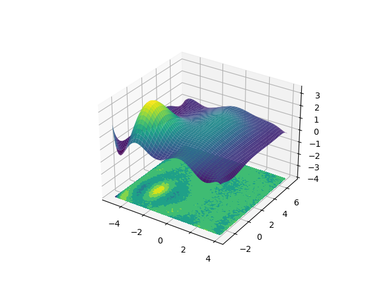

# demo-fitting-a-two-dimensional-polynomial-to-a-surface
This demo presented a way of performing a non-linear least squares fit on two-dimensional data using a sum of (2D) Gaussian functions

`zfit(x,y)=c0,0+c1,0x+c0,1y+c2,0x2+c1,1xy+c0,2y2+…`

Fitting a two-dimensional polynomial to a surface is, in principle, a linear least-squares problem, since the fitting function is linear in the fit coefficients, ci,j:
 
The code in 'src' demonstrates the process, using NumPy's linalg.lstsq method. The presentet code is probably numerically rather unstable and should probably not be used by anyone for any purpose, especially with max_order > 3 or so.

The 2D function to be fit: a sum of two Gaussian functions with synthetic noise added.

